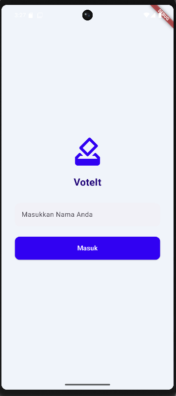
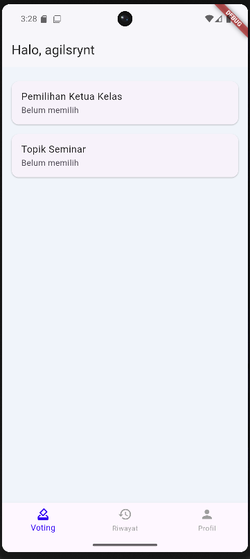
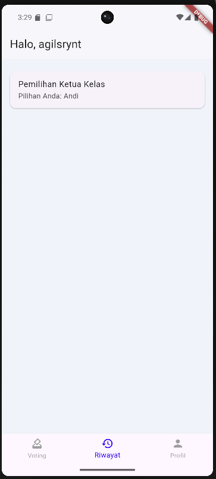
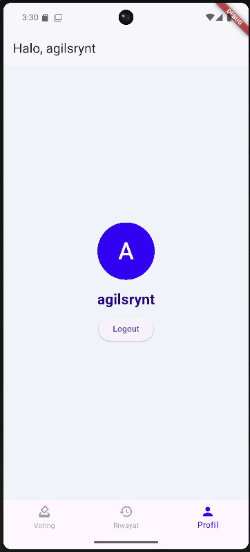

# Voting Internal App frontend

Frontend Aplikasi Voting Internal berbasis Flutter untuk pemilihan ketua kelas, topik seminar, dan lain-lain.  
Voting hanya bisa dilakukan satu kali oleh tiap user.

---

## Screenshot

  
*Halaman Login dengan UI modern dan warna biru dominan*

  
*Halaman utama menampilkan daftar voting dan navigasi bottom bar*

  
*Halaman riwayat voting dengan daftar pilihan yang sudah dipilih*

*Halaman profil dengan tombol logout*

---

## Fitur

- Login sederhana dengan nama pengguna
- Daftar voting aktif
- Voting hanya satu kali per user per voting
- Riwayat voting untuk melihat hasil pilihan
- UI modern dan responsif berbasis Flutter

---